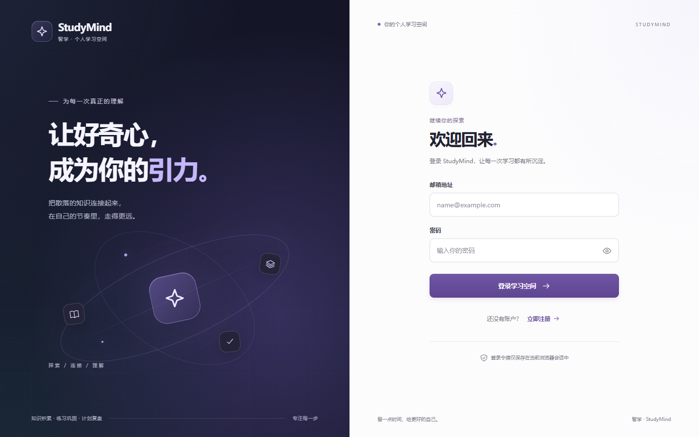
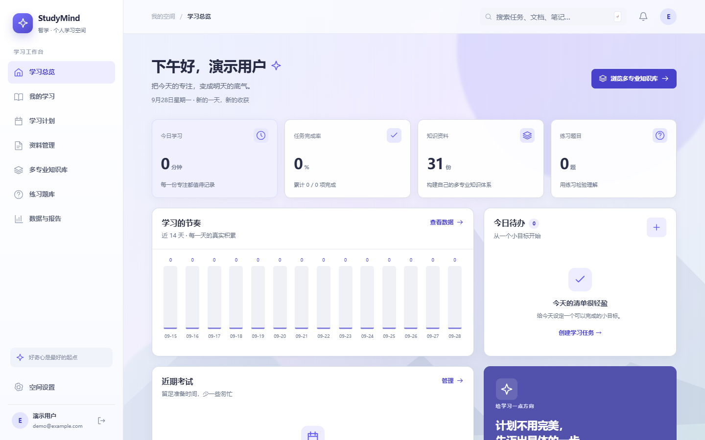
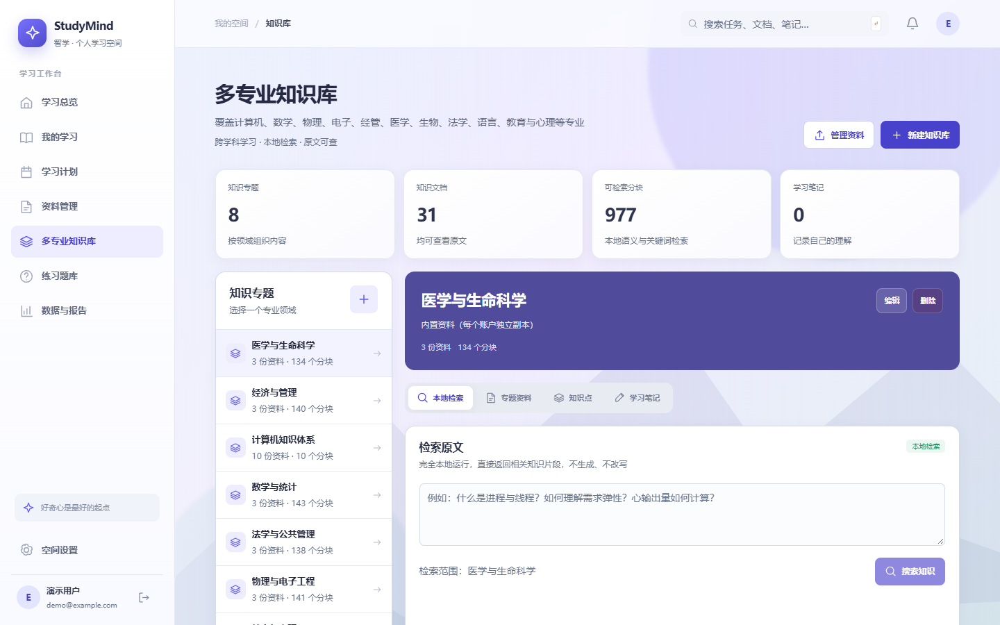
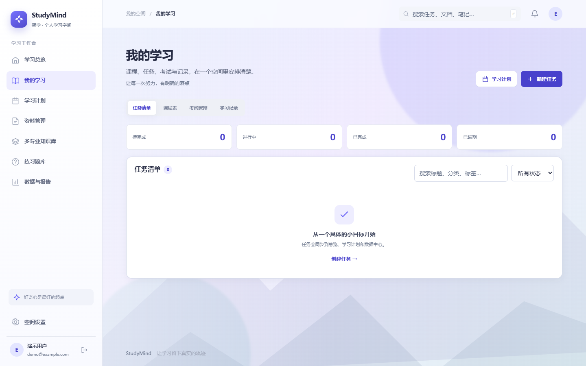
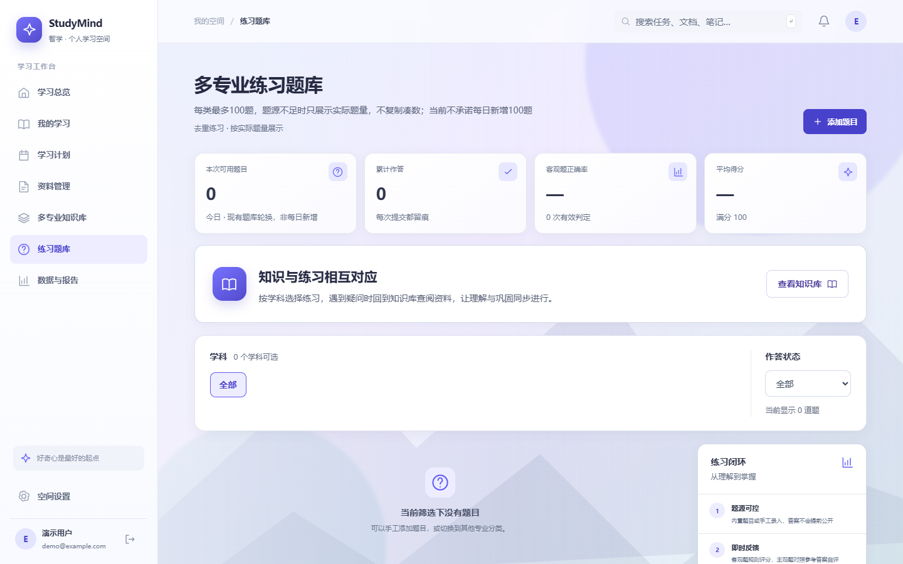
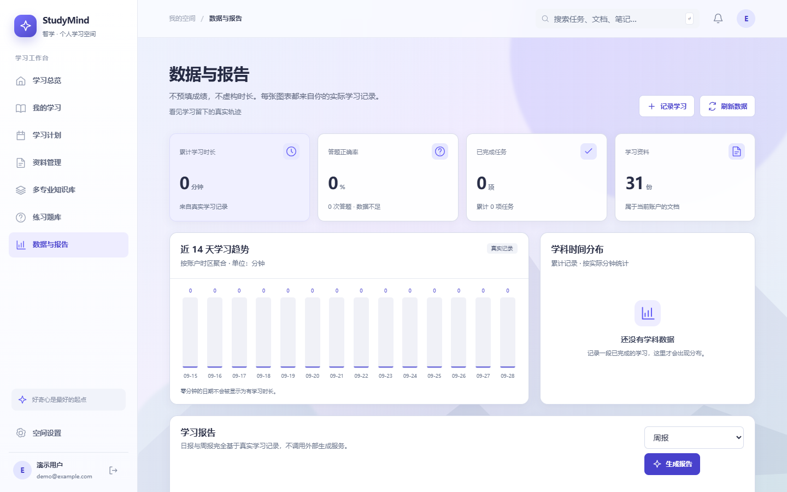
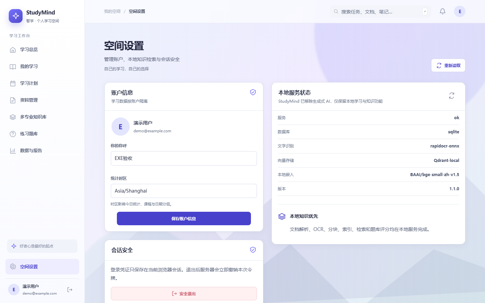

<div align="center">
  

  <p><strong>面向大学生的本地优先 AI 学习与效率助手</strong></p>
  <p>把任务、课程、资料、知识库、练习题、学习记录和 AI 助手放进一个真正可运行的学习空间。</p>

  <p>
    <a href="https://github.com/123qingyuan/StudyMindAI/releases/latest"></a>
    <a href="https://github.com/123qingyuan/StudyMindAI/releases/download/v1.2.1/StudyMindAI.exe"></a>
    
    
    
  </p>

  <p>
    <a href="#快速开始">快速开始</a> ·
    <a href="#界面预览">界面预览</a> ·
    <a href="#核心能力">核心能力</a> ·
    <a href="#源码运行">源码运行</a> ·
    <a href="#配置-ai">配置 AI</a> ·
    <a href="#验证与测试">验证与测试</a>
  </p>
</div>

> [!NOTE]
> Windows 桌面版是独立应用窗口，不会跳转外部浏览器。前端、后端、OCR 组件和内置学习资料已打包进 EXE；干净电脑无需另外安装 Python、Node.js、MySQL 或 Qdrant。

<p align="center">
  
</p>

## 为什么做 StudyMind

学习工具常把计划、资料、练习和统计拆成几个互不相干的入口。StudyMind 把它们串成一条可追踪的学习闭环：

```text
设定目标 → 拆解任务 → 学习与记录 → 整理资料 → 检索知识 → 练习检验 → 复盘数据
                              ↑                                   │
                              └──────── AI 辅助与来源引用 ────────┘
```

项目坚持三条边界：

- **真实数据流**：任务、时长、文档、题目和报告来自真实后端记录，不用静态卡片冒充完成结果。
- **本地优先**：桌面数据默认保存在用户电脑；没有 AI 配置时，任务、资料、OCR、笔记和手工题库仍可使用。
- **AI 不装神**：模型不可用时明确报错；知识库问答保留来源，证据不足时不把固定文本伪装成模型回答。

## 快速开始

### 方案一：直接下载 Windows 桌面版

1. 从 [最新版发布页](https://github.com/123qingyuan/StudyMindAI/releases/latest) 下载 `StudyMindAI.exe`。
2. 双击运行，在独立的 **StudyMind AI · 智学助手** 窗口中注册或登录。
3. 用户数据保存在 `%LOCALAPPDATA%\StudyMindAI\data`。

当前稳定版：[`v1.2.1`](https://github.com/123qingyuan/StudyMindAI/releases/tag/v1.2.1)<br>
直接下载：[`StudyMindAI.exe`](https://github.com/123qingyuan/StudyMindAI/releases/download/v1.2.1/StudyMindAI.exe)

> [!TIP]
> 桌面版默认采用 SQLite 与关键词检索，优先保证单文件交付和离线可用。需要 MySQL、Qdrant 本地向量库或语义嵌入时，使用源码部署版。

### 方案二：从源码运行

适合开发、二次修改或启用完整的 MySQL + Qdrant 能力。详见[源码运行](#源码运行)。

## 界面预览

所有截图均来自真实运行页面，账号信息已替换为演示数据。

### 学习总览

真实聚合今日时长、任务完成率、知识资料、练习数量、近期考试和 14 天学习节奏。

<p align="center">
  <a href="docs/images/dashboard.png"></a>
</p>

### 多专业知识库

按专业组织资料、分块、知识点和笔记；支持本地检索、原文查看和带来源的知识问答。

<p align="center">
  <a href="docs/images/knowledge.png"></a>
</p>

<details>
<summary><strong>查看更多页面截图</strong></summary>

#### 我的学习

<p align="center">
  <a href="docs/images/learning.png"></a>
</p>

#### 多专业练习题库

<p align="center">
  <a href="docs/images/questions.png"></a>
</p>

#### 数据与报告

<p align="center">
  <a href="docs/images/analytics.png"></a>
</p>

#### 空间设置

<p align="center">
  <a href="docs/images/settings.png"></a>
</p>

</details>

## 核心能力

| 模块 | 已实现能力 |
|---|---|
| 账户与安全 | 邮箱注册、登录与退出；Argon2 密码哈希；签名令牌；会话撤销；用户数据隔离 |
| 学习总览 | 任务、学习时长、考试、文档、题目和会话统计；14 天趋势与快捷入口 |
| 任务与计划 | 任务新增、状态、优先级、分类、截止日期和删除；按日期范围生成学习计划草案，确认后写入真实任务 |
| 课程与考试 | 课程、考试安排、学习记录与时间统计 |
| AI 学习助手 | 6 种学习模式、连续上下文、SSE 流式输出、停止/重新生成、Markdown、代码高亮、LaTeX、回答复制 |
| 文档与 OCR | TXT、Markdown、DOCX、PDF 文本提取；扫描 PDF OCR；图片 OCR；上传限制与用户隔离 |
| 多专业知识库 | 知识空间、文档分块、知识点、笔记、本地检索、语义检索、关键词复核、原文引用 |
| 智能练习题库 | 自定义学科；6 种题型；3 档难度；限定知识库来源；手工出题；确定性客观题评分；统计汇总 |
| 数据与报告 | 学习趋势、学科时间分布、任务完成情况、练习统计、基于真实记录的日报/周报 |
| 桌面交付 | PyInstaller 单文件 EXE；WebView2 内嵌窗口；应用关闭时同步停止本地后端 |

### AI 不可用时仍能做什么

- 创建并管理任务、课程、考试和学习记录
- 上传文档、执行 OCR、查看来源、维护笔记
- 使用关键词检索知识分块
- 手工添加题目并进行客观题确定性评分
- 查看真实统计和本地学习报告

应用不会用固定输出假装 AI 在线。需要模型的按钮会给出明确错误，其余功能继续工作。

## 技术架构

```text
┌──────────────────────────────────────────────────────────┐
│ Windows 桌面应用                                         │
│ pywebview + Edge WebView2                                │
│                                                          │
│  Vue 3 + TypeScript + Vite + Pinia + Element Plus        │
│                         │ HTTP / SSE                     │
│  FastAPI + SQLAlchemy + Argon2 + PyJWT                   │
│          │                    │                 │         │
│  SQLite / MySQL       Qdrant / 关键词检索      OCR/文档解析 │
│                                                          │
│ 数据目录：%LOCALAPPDATA%\StudyMindAI\data                │
└──────────────────────────────────────────────────────────┘
```

### 主要技术栈

- **前端**：Vue 3、TypeScript、Vite、Vue Router、Pinia、Element Plus
- **富文本**：Markdown-it、DOMPurify、Highlight.js、KaTeX
- **后端**：FastAPI、Uvicorn、Pydantic、SQLAlchemy
- **安全**：Argon2、PyJWT、Cryptography
- **文档处理**：PyMuPDF、python-docx、Pillow、RapidOCR ONNX Runtime
- **知识检索**：Qdrant Client、FastEmbed、scikit-learn；桌面版提供关键词回退
- **桌面封装**：pywebview、Edge WebView2、PyInstaller
- **测试**：pytest、pytest-asyncio、Playwright

## 源码运行

### 环境要求

- Windows 10/11
- Python 3.13
- Node.js 与 npm
- 可选：MySQL 8、Qdrant 或兼容的本地向量配置

### 1. 安装前端依赖并构建

```powershell
cd E:\StudyMindAI\frontend
npm ci
npm run typecheck
npm run build
```

### 2. 安装后端依赖

```powershell
cd E:\StudyMindAI\backend
python -m venv .venv
.venv\Scripts\python.exe -m pip install -r requirements.txt
```

### 3. 启动应用

```powershell
cd E:\StudyMindAI
backend\.venv\Scripts\python.exe scripts\launch.py
```

浏览器模式访问 <http://127.0.0.1:8765>。Windows 下也可以双击根目录的 `start.bat`。

## 配置 AI

复制示例配置：

```powershell
Copy-Item .env.example backend\.env
```

填写兼容 OpenAI API 的模型信息：

```dotenv
MODEL_PROVIDER=openai-compatible
MODEL_NAME=你的模型名称
API_KEY=你的接口密钥
BASE_URL=https://api.openai.com/v1
```

- `API_KEY` 只在后端使用，不返回浏览器。
- 配置存在不等于服务可用；应用会以一次真实请求结果判断模型是否能工作。
- 生产环境不要开启 `AI_ALLOW_PRIVATE_ENDPOINTS`，除非管理员明确允许受信任的私网模型地址。
- `.env`、数据库、模型缓存和用户上传内容均不应提交到 Git。

## 构建 Windows EXE

项目提供一键构建脚本：

```powershell
cd E:\StudyMindAI
scripts\build_exe.bat
```

脚本会依次执行：

1. `npm run typecheck`
2. `npm run build`
3. `PyInstaller --clean StudyMindAI.spec`

输出文件：`dist\StudyMindAI.exe`。

## 项目结构

```text
StudyMindAI/
├─ backend/
│  ├─ app/                 # FastAPI、认证、数据库、AI、知识库与文档处理
│  ├─ tests/               # 后端测试
│  └─ requirements.txt
├─ frontend/
│  ├─ src/                 # Vue 页面、组件、状态与 API 客户端
│  └─ package.json
├─ data/
│  ├─ builtin/             # 受控内置学习资料
│  └─ question_bank_manifest.json
├─ docs/images/            # README 产品截图
├─ logo/                   # SVG 标志与应用图标
├─ scripts/
│  ├─ desktop_main.py      # WebView2 桌面入口
│  ├─ build_exe.bat        # Windows 构建脚本
│  └─ launch.py            # 源码启动器
├─ StudyMindAI.spec        # PyInstaller 配置
├─ start.bat
└─ README.md
```

## 数据、隐私与安全

- 桌面数据默认保存在 `%LOCALAPPDATA%\StudyMindAI\data`。
- 源码部署可通过 `DATABASE_URL` 使用 SQLite 或 MySQL。
- 密码使用 Argon2 哈希，不以明文保存。
- 上传文件、文档、笔记、知识库和题目按账户隔离。
- 桌面服务只监听 `127.0.0.1:8765`，不默认暴露到局域网。
- 登录令牌仅保存在当前 WebView/浏览器会话。
- 内置资料为受控、带来源的起始内容；每个账户拥有独立副本，可编辑或删除。

## 验证与测试

### 后端测试

```powershell
cd E:\StudyMindAI\backend
.venv\Scripts\python.exe -m pytest tests -q
```

### 前端检查

```powershell
cd E:\StudyMindAI\frontend
npm run typecheck
npm run build
```

### 项目验收脚本

```powershell
cd E:\StudyMindAI
backend\.venv\Scripts\python.exe scripts\verify_documents.py
backend\.venv\Scripts\python.exe scripts\verify_api.py
backend\.venv\Scripts\python.exe scripts\verify_browser.py
backend\.venv\Scripts\python.exe scripts\verify_completed_features.py
backend\.venv\Scripts\python.exe scripts\verify_completed_browser.py
```

浏览器验收使用本机 Edge 和一次性账户，覆盖登录、Dashboard、任务、课程、考试、学习记录、计划发布、笔记、文档预览、AI 未配置边界、主要路由与移动端导航。

## 常见问题

<details>
<summary><strong>双击 EXE 后窗口没有打开</strong></summary>

确认系统已安装 Microsoft Edge WebView2 Runtime。Windows 10/11 通常已随 Edge 提供该运行时。应用日志位于 `%LOCALAPPDATA%\StudyMindAI\data\app.log`。
</details>

<details>
<summary><strong>提示端口 8765 被占用</strong></summary>

StudyMind 的桌面后端固定监听本机 `127.0.0.1:8765`。关闭占用该端口的程序后重新启动。
</details>

<details>
<summary><strong>AI 按钮提示模型未配置或连接失败</strong></summary>

在 `backend/.env` 或应用设置中填写正确的模型名称、接口密钥和基础地址。网络、余额、权限和模型名错误都会导致真实请求失败；应用不会伪造成功结果。
</details>

<details>
<summary><strong>桌面版为什么默认不是语义检索</strong></summary>

单文件版优先控制体积、启动复杂度和本地资源占用，因此默认使用关键词检索。源码版可启用 Qdrant 与中文嵌入模型 `BAAI/bge-small-zh-v1.5`。
</details>

## 当前边界

- 桌面版默认使用 SQLite 与关键词检索；完整向量语义检索建议使用源码部署。
- 本地 Qdrant 文件存储只允许一个进程持有，源码模式应保持单 Uvicorn worker。
- Redis/Celery 异步队列和生产级多 worker 部署不在当前本地版本范围内。
- AI 出题和主观题量规评阅依赖用户配置的模型供应商。
- 当前仓库未声明开源许可证；代码可供查看，但在添加许可证前不要默认拥有复制、修改或再分发权利。

## 参与与反馈

发现问题或希望增加功能，可在 [Issues](https://github.com/123qingyuan/StudyMindAI/issues) 中提交。请附上：

- Windows 版本与 StudyMind 版本
- 重现步骤与实际现象
- `%LOCALAPPDATA%\StudyMindAI\data\app.log` 中与问题相关的日志（提交前删除密钥、令牌和私人内容）

---

<div align="center">
  <strong>StudyMind AI</strong><br>
  让学习留下真实的轨迹。
</div>
