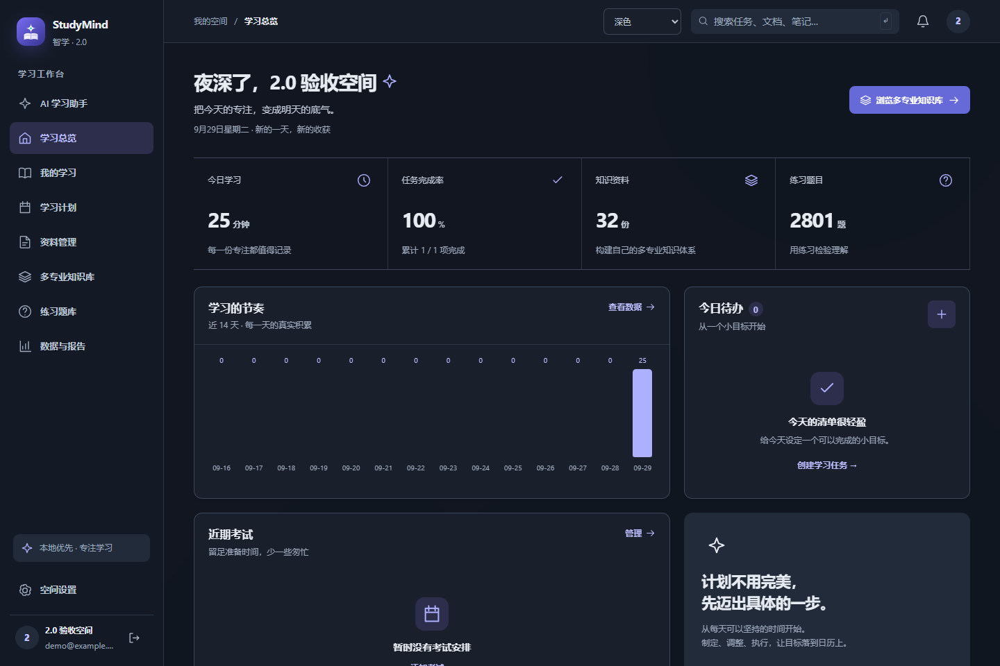

<div align="center">
  
  <p><strong>面向大学生日常学习的本地优先学习空间</strong></p>
  <p>任务、课程、资料、知识库、练习与学习记录集中管理；AI 是可选辅助，不是离线学习的前提。</p>
  <p>
    <a href="https://github.com/123qingyuan/StudyMindAI/releases/tag/v2.0.0">Windows 桌面版 v2.0.0</a> ·
    <a href="#linux-一键部署">Linux 一键部署</a> ·
    <a href="#功能与边界">功能与边界</a> ·
    <a href="docs/LINUX.md">部署与备份文档</a>
  </p>
</div>

## 选择使用方式

| | Windows 2.0 桌面版 | Linux Docker 部署（main） |
|---|---|---|
| 入口 | 下载 EXE，双击打开独立应用窗口 | 克隆仓库后执行 `bash deploy.sh`，通过浏览器访问 |
| 适用场景 | 个人电脑日常学习 | 自建 Linux 主机上的个人学习空间 |
| 前提 | Windows 10/11、Microsoft Edge WebView2 Runtime | Linux x86_64/amd64、Git、Bash、Docker Engine、Compose v2 |
| 默认存储与检索 | SQLite + 关键词检索 | SQLite + 关键词检索、单 worker |
| 数据位置 | `%LOCALAPPDATA%\StudyMindAI\data` | Compose `app-data` 命名卷，容器内 `/var/lib/studymind` |
| 交付边界 | 已发布的 `v2.0.0` EXE | 新增于 `main` 的部署脚本；不是 Linux 桌面安装包，也不包含在旧发布标签中 |

两种方式使用各自的数据目录，**不会自动同步或迁移 Windows/MySQL 数据**。默认只监听本机回环地址，不直接向公网开放。

## Windows 2.0 桌面版

**[下载 StudyMindAI.exe](https://github.com/123qingyuan/StudyMindAI/releases/download/v2.0.0/StudyMindAI.exe)** · [发布说明与 SHA256 校验文件](https://github.com/123qingyuan/StudyMindAI/releases/tag/v2.0.0)

1. 下载并运行 `StudyMindAI.exe`，在独立的 **StudyMind AI · 智学助手** 窗口中注册或登录。
2. 前端、后端、OCR 与受控内置学习资料随 EXE 打包，无需另装 Python、Node.js、MySQL 或 Qdrant。
3. 若窗口无法打开，检查 WebView2 Runtime；日志位于 `%LOCALAPPDATA%\StudyMindAI\data\app.log`。

2.0 提供**浅色、深色、跟随系统**三种外观，保留任务、课程、考试、资料与练习的真实数据流。主题升级不代表完整 Learning OS 路线图已经实现。

### 2.0 界面预览

以下为仓库已有的 2.0 深色工作台验收截图；展示的是演示空间和验收记录，不代表新账户的默认学习成果，也不是 Linux 部署成功的证据。历史版本截图不再作为当前首页展示。



## Linux 一键部署

### 前提

- Linux **x86_64/amd64**；建议至少 2 核、4 GB RAM，并预留镜像及上传文件空间。ARM64 暂不承诺支持。
- 已安装 Git、Bash，以及 [Docker Engine](https://docs.docker.com/engine/install/) 和 **Compose v2**；Compose 必须支持 `up --wait --wait-timeout`。
- 当前用户能运行 `docker info`；不要将 Docker socket 权限改为 `666`。Docker 组权限近似 root。
- 首次构建需要联网下载基础镜像和依赖。宿主机不必另装 Python 或 Node.js；镜像使用 **Python 3.12**，不是 Windows 开发环境的 3.13。

在准备好的 Linux 主机执行：

```bash
git clone https://github.com/123qingyuan/StudyMindAI.git
cd StudyMindAI
bash deploy.sh
```

部署成功后，在**该主机**访问 <http://127.0.0.1:8765> 并自行注册，没有默认账户或密码。必须保留完整仓库中的受控 `data/builtin/` 和题库清单，不要只复制脚本。

脚本检测 Docker/Compose、仅在不存在时创建 `.env.linux`、构建镜像、等待健康检查并请求首页；构建失败不会先停止现有服务。它不自动安装 Docker、不修改防火墙、不覆盖已有 `.env`/`.env.linux`、不删除数据卷。

### 远程访问与维护

默认地址是**服务器本机地址**，不是你的客户端地址。私人远程访问可在客户端建立 SSH 隧道，再打开客户端的 `http://127.0.0.1:8765`：

```bash
ssh -L 8765:127.0.0.1:8765 your-user@your-server
```

正式远程访问请配置 HTTPS 反向代理及访问控制；不要直接将 8765 暴露到公网。注册入口没有邀请审批，公网部署还需考虑注册滥用、限流和存储配额。

项目根目录下查看状态和日志：

```bash
docker compose --env-file .env.linux ps
docker compose --env-file .env.linux logs --tail=100 app
```

**升级前先做完整备份**，记录 Git revision 和镜像 ID；确认工作区干净并审阅更新后执行：

```bash
git pull --ff-only
bash deploy.sh
```

命名卷保存 SQLite、上传文件、JWT 密钥和 AI 配置加密密钥；重建容器不应删除这些数据。备份不能只有数据库，也必须包含上传文件和密钥。保持相同的 Compose 项目名及部署环境变量，避免误接到新卷。

> **不要执行 `docker compose down -v` 或 `docker volume prune`：可能删除数据。** 回退不保证数据库向后兼容，应在独立项目恢复升级前备份并验证。Windows 更新也应先关闭应用、备份完整数据目录，再替换 EXE，保留原数据。

完整配置、停机一致性备份、恢复、HTTPS 示例和验收命令见 **[Linux 部署文档](docs/LINUX.md)**。

### Linux CI 的实际结果

已核对 [Actions 运行 36524138537](https://github.com/123qingyuan/StudyMindAI/actions/runs/36524138537)：提交 `040161e6b922fd1fb26102cffdc82151c9af118c`，Ubuntu 24.04 / amd64，结果 **success**。日志中可见：

- 实际镜像构建、健康启动和 `Homepage OK`。
- 注册/登录与首页静态资源检查通过；非 root UID `10001` 下的 OCR、PDF、DOCX、关键词检查通过。
- 读回 28 类、2800 题、31 份文档；这是内置内容数量检查，不是课程质量或每题正确性的认证。
- 重复部署后 `.env.linux: OK`；强制重建后旧会话仍可用，数据数量与密钥摘要一致。

**保留限制：**该次运行的日志附件未上传（`No files were found`），另有 Actions Node.js 20 弃用警告；以上依据运行日志，不声称存在可下载的验收附件。工作流部分命令通过 `tee` 管道执行且未显式启用 `pipefail`，不能只凭绿色状态判断每条命令成功。本次已核对具体输出；CI 不覆盖真实 AI 供应商、ARM64、公网安全或长期负载。此次文档更新不修改工作流代码。

## 功能与边界

以下按当前挂载的页面与后端入口整理，不以保留的源码文件推断已交付功能。

| 能力 | 当前范围 |
|---|---|
| 任务与学习记录 | 任务、课程、考试、时长记录；人工学习计划草案确认后写入任务 |
| 资料与 OCR | TXT、Markdown、DOCX、PDF 解析，扫描件与图片 OCR |
| 知识库 | 资料组织、分块、知识点、笔记、原文查看；默认关键词检索 |
| 练习题库 | 内置来源标记题库、手工题目、客观题确定性评分、练习记录 |
| 数据与报告 | 依据实际记录生成趋势和日报/周报摘要，不冒充模型生成报告 |
| 可选 AI | 个人设置、真实连接测试、六种对话模式、流式对话；知识库问答依赖可用模型与检索证据 |
| 桌面外观 | 浅色 / 深色 / 跟随系统；独立 WebView2 窗口 |

**无需在线模型**即可管理任务、资料、OCR、笔记、关键词检索、手工题目、客观题评分与统计。模型不可用时，不用固定内容伪装为 AI 回答。

当前不承诺：

- **AI 出题、AI 计划生成、主观题模型评阅**尚未开放。
- **Agent 自动执行、知识图谱、Learning Twin**不作为已交付能力宣传。
- 每日练习是已有题池轮换，**不是每日自动新增题目**。旧版扩展资料仍标记“含重复待整理”，数量不代表优质长课程。
- Windows EXE 和默认 Linux 镜像均以关键词检索为基线。Linux 不含 Qdrant/FastEmbed 或向量模型，设置保持 `keyword`；切换选项不等于安装了语义检索能力。
- 当前不承诺生产级多 worker、Redis/Celery 队列或大规模多租户部署。

## 配置 AI

在应用内进入 **空间设置 → 个人 AI 设置**，填写自己的服务商、精确模型 ID、基础地址与密钥，保存后点击 **测试已保存连接**。测试会发送固定问候，可能产生少量费用。

- **保存配置 ≠ 供应商可用。** 应以真实连接测试及实际对话的结果为准。
- 当前用户的个人中转站**尚未验证成功**；本次文档更新及 Linux CI 没有进行真实供应商联网验收，不承诺任意中转兼容。
- 个人密钥加密保存；删除个人配置后回退服务器默认配置（若有）。发布 EXE 和 Linux 镜像不预置开发者密钥。
- 使用在线模型会向所配置服务商发送相应请求内容；本地优先不等于启用 AI 后数据绝不离机。
- 不要公开 `.env`、密钥、令牌、数据库或私有上传；不要为绕过连接错误随意开启私网端点访问。

## 开发与项目导航

前端为 Vue 3 + TypeScript，后端为 FastAPI + SQLAlchemy；Windows 使用 pywebview/WebView2 + PyInstaller，Linux 使用 Docker Compose。Linux 安装与运行以 [docs/LINUX.md](docs/LINUX.md) 为准，勿直接套用 Windows Python 版本和桌面依赖。

| 文件 / 目录 | 用途 |
|---|---|
| [PRODUCT.md](PRODUCT.md) / [DESIGN.md](DESIGN.md) | 产品范围与设计系统 |
| [CHANGELOG.md](CHANGELOG.md) | 版本更新记录 |
| [backend/](backend/) / [frontend/](frontend/) | 后端与前端源码 |
| [deploy.sh](deploy.sh) / [compose.yaml](compose.yaml) / [Dockerfile](Dockerfile) | Linux 部署入口与镜像 |
| [backend/requirements-linux.txt](backend/requirements-linux.txt) | Linux Python 3.12 哈希锁定依赖 |
| [scripts/build_exe.bat](scripts/build_exe.bat) / [StudyMindAI.spec](StudyMindAI.spec) | Windows EXE 构建 |
| [.github/workflows/linux-deploy.yml](.github/workflows/linux-deploy.yml) | Linux 集成测试定义 |

## 反馈与数据安全

在 [Issues](https://github.com/123qingyuan/StudyMindAI/issues) 提交系统版本、EXE 版本或 Git revision、部署方式、复现步骤和已脱敏日志。不要附带真实密钥、令牌、数据库或个人资料。

内置资料是带来源的起始内容，每个账户拥有独立副本，可编辑或删除；不是用户原创或现场 AI 生成。仓库尚未声明开源许可证，公开可查看不等于已授予任意修改、再分发许可；第三方资料还须遵守各自来源条款。
